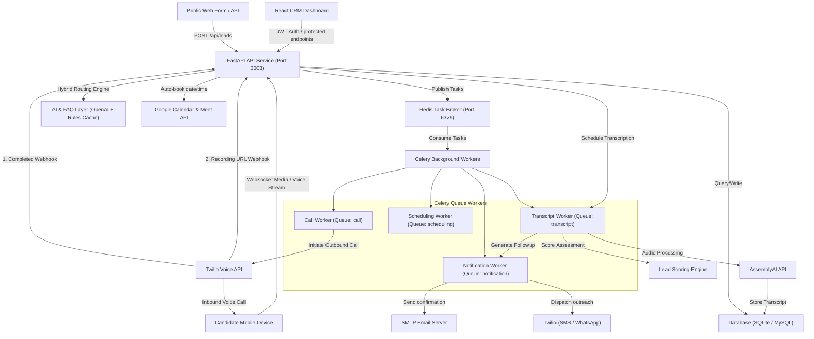

# AI Phone Agent & CRM Platform

An advanced, enterprise-grade AI-powered Calling CRM platform that automates lead management, outbound calling, interactive voice conversations, post-call transcription, automated follow-ups, and interview scheduling.

This platform bridges the gap between digital marketing campaigns and live sales interactions by deploying intelligent AI voice agents to follow up on leads in real-time, qualification scoring, and scheduling Google Meet links with prospective clients or candidates.

---

## 🚀 Key Features

* **Lead Management & Campaign Attribution:** Capture leads from public forms or authenticated APIs. Tracks campaign metrics such as UTM source, utm_medium, utm_campaign, and keywords.
* **Intelligent Outbound Calling:** Triggers automated outbound calls using Twilio Voice API.
* **Hybrid AI Voice Conversations:** Leverages a hybrid model combining a deterministic rule-based FAQ layer (for common queries about fees, syllabus, location) with OpenAI GPT (for dynamic conversation turns and screening questions) to minimize API latency and token cost.
* **Post-Call Speech-to-Text Transcription:** Offloads transcription tasks asynchronously post-call using AssemblyAI's universal-2 model, minimizing overhead during active calls.
* **Automated Notification Engine:** Dispatches personalized SMS, WhatsApp, and Emails based on call results and scheduled triggers.
* **Celery & Redis Asynchronous Queue:** A production-safe, persistent background task worker architecture handling voice campaigns, smart retry loops, transcription, and scheduling.
* **Google Meet & Calendar Integration:** Auto-books interviews or demos on Google Calendar and emails Google Meet links whenever a candidate provides a valid date and time.
* **Lead scoring & Temperature Tracking:** Auto-evaluates call results and engagement metrics to classify leads as **Hot**, **Warm**, or **Cold**.
* **SSL/HTTPS Enabled (Local & Prod):** Built-in support for secure webhooks (HTTPS and WSS protocols) with self-signed SSL certs on local development.

---

## 📐 System Architecture



---

## 📂 Repository Structure

```
├── backend/                       # FastAPI Backend Service
│   ├── app/
│   │   ├── api/v1/                # Endpoint routing (auth, leads, calls, workers, etc.)
│   │   ├── core/                  # Database, Redis client, security, config settings, logging
│   │   ├── models/                # SQLAlchemy schemas (Lead, Call, User, Conversation, etc.)
│   │   ├── schemas/               # Pydantic models for validation
│   │   ├── services/              # Business logic (AI memory, AI workflows, Lead scoring)
│   │   └── workers/               # Celery app config and task definitions
│   ├── database/                  # Alembic migrations & setup configs
│   ├── storage/                   # Local file caching & log files
│   ├── main.py                    # Entry point for backend & local API gateway proxy
│   ├── requirements.txt           # Python backend dependencies
│   ├── run_backend.sh             # HTTPS-enabled script to run Backend
│   ├── run_workers.sh             # Celery workers startup script
│   └── worker.py                  # Entrypoint for Celery runner
│
├── frontend/                      # React SPA Dashboard (Vite-powered)
│   ├── src/
│   │   ├── components/            # Reusable UI components & layouts
│   │   ├── pages/                 # CRM Screens (Dashboard, Leads, Call Logs, Settings)
│   │   ├── App.jsx                # Router & central provider configs
│   │   └── main.jsx               # SPA mounting entrypoint
│   ├── index.html
│   ├── package.json               # Node.js frontend dependencies
│   └── vite.config.js             # Vite development server configuration (SSL-ready)
│
├── cert/                          # Local self-signed SSL/HTTPS Certificates
│   ├── cert.pem                   # Public SSL Certificate
│   └── key.pem                    # Private Key file
│
├── SETUP_NGROK.sh                 # Interactive utility to configure & test ngrok webhooks
├── START_WITH_HTTPS.sh            # HTTPS-ready quick launch overview script
├── Document.md                    # Detailed lead-to-call technical flow documentation
└── AI_CRM_Implementation_Plan.md  # System scaling implementation blueprint
```

---

## ⚙️ Prerequisites & Setup

Ensure the following tools are installed locally on your system:
* **macOS / Linux**
* **Python 3.10 or higher**
* **Node.js v18 or higher** (with `npm`)
* **Redis Server** (listening on standard port `6379`)
* **ngrok** (required for routing Twilio webhooks to localhost during development)

### 1. Initialize Local SSL Certificates
The system requires HTTPS/SSL to secure real-time WebSockets and receive secure webhooks locally.
Self-signed certificates are pre-configured in the `cert/` directory (`cert.pem`, `key.pem`).
To inspect the certificates or verify setup details, check [START_WITH_HTTPS.sh](file:///Users/ifocus/Documents/kill/START_WITH_HTTPS.sh).

### 2. Configure Environment Variables
Inside both `backend` and `frontend` folders, environment configurations are isolated:

#### Backend Settings
Copy the backend environment template and fill in the values:
```bash
cd backend
cp .env.example .env
```
*Key configurations to review inside `backend/.env`:*
* **Database & Cache:** Configure `DATABASE_URL` (SQLite file e.g., `sqlite+aiosqlite:///../test.db` or a MySQL connection string) and `REDIS_URL` (`redis://localhost:6379`).
* **Telephony Configs:** Provide your `TWILIO_ACCOUNT_SID`, `TWILIO_AUTH_TOKEN`, `TWILIO_PHONE_NUMBER`, and `TWILIO_WEBHOOK_URL` (or ngrok endpoint).
* **AI & Language processing:** Define `OPENAI_API_KEY`, `ASSEMBLYAI_API_KEY` for transcription, and optional SMTP configs for email dispatch.
* **Local Mock Mode:** Set `MOCK_SERVICES=true` to simulate external API responses during UI development without exhausting Twilio or OpenAI credit.

#### Frontend Settings
Configure Vite API integrations in the `frontend/.env` file:
```env
VITE_API_BASE_URL=https://localhost:3003
VITE_APP_NAME="AI Phone Agent"
```

---

## 🏃 Run the Application Locally

Follow these steps across dedicated terminal windows to start all components:

### Terminal 1: Run Redis Broker
Celery requires Redis to distribute tasks. Start Redis:
```bash
# macOS Brew installation
brew services start redis
# Or start in foreground
redis-server
```

### Terminal 2: Run Background Workers (Celery)
Workers process telephony calls, notifications, transcripts, and retries:
```bash
cd backend
source .venv/bin/activate
./run_workers.sh
```
*Note: If running for the first time, make sure `celery` dependencies are installed via `pip install -r requirements.txt` inside the virtual environment.*

### Terminal 3: Run the FastAPI Backend
Start the HTTPS-secured FastAPI backend server (running on port `3003`):
```bash
cd backend
chmod +x run_backend.sh
./run_backend.sh
```
*This script automatically creates a Python virtual environment (`.venv`), installs dependencies, stops any running processes on port `3003`, and launches Uvicorn using the SSL certificate files.*

### Terminal 4: Run the Vite Frontend
Launch the React frontend development server (running on port `5173` with SSL active):
```bash
cd frontend
npm install
npm run dev
```
Open your browser and navigate to **`https://localhost:5173`**.
> [!NOTE]
> Since this application uses self-signed SSL certificates locally, your browser will show an **"Your connection is not private"** warning. This is expected. Click **"Advanced"** and click **"Proceed to localhost (unsafe)"** for both the frontend (`https://localhost:5173`) and backend (`https://localhost:3003`) links.

---

## 📞 Twilio Webhook Routing Setup (ngrok)

Because Twilio communicates via public webhooks, it cannot send live call notifications directly to a private `localhost` server. To receive incoming Twilio callbacks, you must build a secure tunnel using **ngrok**:

1. Open a new terminal and fire up the ngrok tunnel forwarding HTTPS traffic to port `3003`:
   ```bash
   ngrok http https://localhost:3003
   ```
2. Copy the generated public HTTPS URL (e.g. `https://a1b2-34-56-78.ngrok-free.app`).
3. Run the interactive setup script to automatically update your backend `.env` variables and test connection integrity:
   ```bash
   ./SETUP_NGROK.sh
   ```
4. Enter the copied ngrok HTTPS URL when prompted. The script automatically updates the `TWILIO_WEBHOOK_URL` in the backend environment, tests endpoints via simulated payloads, and provides next steps.
5. Kill and restart your backend inside **Terminal 3** for changes to take effect.

---

## 💡 How it Works — Under the Hood

### 1. Lead Ingestion & Automation Trigger
When a lead is submitted (either manually inside the CRM or through a public web form), the system executes a centralized automated workflow:
* The lead's details are written to the database.
* An initial call template and opening message script are dynamically drafted.
* An outbound call task is pushed to the Celery scheduling queue to initiate dialer orchestration.

### 2. Conversational Voice Engine (The Calling Phase)
Once a voice connection is established, the backend handles real-time speech interaction through a modular architecture:
* **Interactive Voice Responses (IVR Gather):** The voice system generates interactive Twilio TwiML configurations requesting speech inputs with an auto-timeout.
* **Hybrid Prompt Processing:** The system intercepts incoming transcript speech. Known FAQs (e.g., pricing questions) are immediately handled locally using cached matching rules, reducing API delay. General questions or qualification screening answers are routed to the OpenAI pipeline to produce context-aware responses.
* **WebSocket Streams:** Integrations are built for real-time PCM audio streaming via secure websockets (`wss://`) for fluid, low-latency live talking.

### 3. Smart Retry Loop
If a lead does not answer, is busy, or hangs up early:
* The telephony webhook reports the outcome status.
* Celery enqueues a delayed retry event (e.g. retry 1 in 15 minutes, retry 2 in 2 hours).
* If still unreachable, a personalized follow-up message is dispatched via WhatsApp or SMS to rescue the drop-off rate.

### 4. Post-Call Processing & Transcription
Once a call completes successfully:
* The Twilio recording callback triggers the **Transcript Worker**.
* The worker downloads the call recording binary.
* The raw audio is securely offloaded to AssemblyAI's universal speech model.
* The finalized text is stored directly within the database call document.

### 5. Lead Scoring & Google Meet Scheduling
* **Engagement Evaluation:** The AI analyzes the completed conversation transcript to calculate a qualification score. Based on standard metrics (e.g., candidate interest, qualifying answers), the lead temperature is categorized as **Hot**, **Warm**, or **Cold**.
* **Calendar Automation:** If the candidate expresses a direct intent to book a demo and confirms a valid slot, the FastAPI calendar service hooks into the **Google Calendar API** to schedule a meeting, generate a dynamic **Google Meet** link, and dispatch transactional emails and texts to confirm the booking details.

---

## 🛠️ Verification & Testing

You can inspect and test the status of various subsystems directly:
* **Health Check Endpoint:** Verify backend service status: `curl -k https://localhost:3003/health`
* **Prometheus Metrics:** Monitor service latencies, failure frequencies, and API payloads via `https://localhost:3003/metrics` (if `ENABLE_METRICS=true` is set).
* **Simulated Webhook Payloads:** Use `./SETUP_NGROK.sh` to trigger simulated Twilio call event payloads and verify internal pipeline flows.

---

## 🔒 Security Best Practices

* **JWT Authenticated Endpoints:** Sensitive CRM APIs are secured by robust JSON Web Token middleware routing.
* **Internal API Token Guard:** Direct internal tasks between workers and backend routers are authenticated using the configured `INTERNAL_API_TOKEN` parameter.
* **PII Masking:** Prompts dispatched to external model endpoints are stripped of sensitive personal identifier values where applicable.
